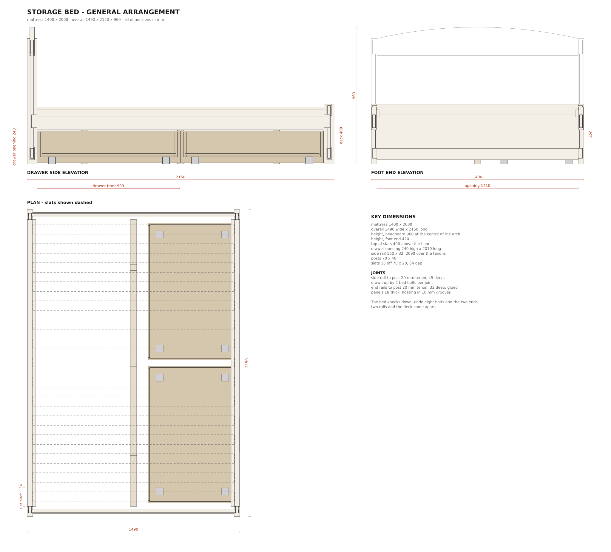

# Storage bed — parametric design for FreeCAD

A double bed in the style of the IKEA photo this started from: an arched
headboard, a low foot end, a slatted deck and two big drawers on castors under
one long side. Rebuilt as something a carpenter can make in **solid timber**,
with real joinery rather than cam locks, and with every dimension driven from
one file.

Mattress **1400 × 2000 mm**. Overall **1490 wide × 2150 long**, 960 high at the
crown of the headboard, mattress deck 400 above the floor.



## What is here

| File | What it does |
| --- | --- |
| `model.py` | Every dimension and every part, as plain Python. **This is the design.** |
| `freecad_bed.py` | Builds the 3D model in FreeCAD and exports `bed.FCStd` + `bed.step` |
| `drawings.py` | Writes the isometric, the general arrangement and a sheet per part |
| `cutlist.py` | Writes `out/cutlist.md` and `out/cutlist.csv` |
| `build.py` | Runs the two above — no FreeCAD needed |
| `tools/fakecad.py` | A stub of the FreeCAD API so the macro can be tested without it |
| `tests/` | Checks that no two parts occupy the same wood, the mattress fits, the drawers run clear, and the cut list matches the model |
| `out/` | The generated drawings and cutting list |

## Running it

Drawings and cutting list, with nothing installed but Python:

```sh
python3 build.py
python3 -m unittest discover -s tests    # 20 checks on the geometry
```

The 3D model, in [FreeCAD](https://www.freecad.org) (free, Windows/Mac/Linux):

```sh
freecadcmd freecad_bed.py                # headless; writes out/bed.FCStd and out/bed.step
```

or in the GUI: **Macro → Macros… → User macros location →** point it at this
folder, select `freecad_bed.py`, **Execute**. You get a document tree grouped by
sub-assembly (Head end, Foot end, Side rails, Deck, Drawer 1, Drawer 2) with one
solid per part, each with its mortises, grooves and bolt holes cut in. The
`.step` file opens in any other CAD program, and in most online viewers.

## Changing the design

Everything is at the top of `model.py`. Change a number, run `build.py`, and the
drawings, the cutting list and the FreeCAD model all follow.

```python
MAT_W, MAT_L, MAT_H = 1400, 2000, 200   # a 1600 mm mattress: change one number
DECK_Z = 400                            # lower this for a lower bed, and the
                                        # drawers get shallower to match
N_DRAWERS = 2                           # 0 for a plain frame
ARCH_RISE = 80                          # flatten or lift the headboard curve
```

Run the tests afterwards — they catch the things that quietly break when a size
changes, such as a tenon that no longer clears the one crossing it inside the
same post.

## How it goes together

**The ends** are frame and panel: two posts (70 × 40), a bottom rail, a top
rail, and a panel that floats in a 10 mm groove. The headboard's top rail is cut
from a 200 mm blank with the top edge sawn to an arc rising 80 mm at the centre,
so it finishes flush with the posts at each end. The panels are **not glued** —
solid wood moves across the grain, and a glued panel splits.

**The rails to the posts** is the joint that matters. A 20 mm tenon, 40 long,
locates the rail; two M8 bed bolts per joint pull it home into a barrel nut
cross-drilled into the rail 30 mm past the shoulder. Counterbore the post's
outside face 20 mm and cap it. That is what makes the bed knock down: undo eight
bolts and it comes apart into two ends, two rails and the deck.

**The deck** is 15 slats at 134 mm centres (64 mm gaps) sitting on bearers glued
and screwed inside the rails, with a 95 × 45 beam down the middle on three legs
to the floor. Screw each slat to the beam — that beam is what stops a double bed
sagging, and it also stops the slats walking.

**The drawers** are 620 deep, run on four 50 mm castors each, and pull straight
out of the 240 mm opening under the side rail. There is nothing to fit or align
— no runners — which is exactly how IKEA does it. The centre beam's legs sit
inboard of the drawers, so they never touch.

## Notes for the carpenter

- All part sheets in `out/part-*.svg` carry a **setting-out table**: every
  mortise, groove and hole given as a distance from one end, so you can mark out
  from a single datum rather than chasing cumulative errors.
- Cut and fit the joints **before** shaping the headboard curve.
- The panels are given a 3 mm gap in the grooves top and bottom for movement.
  In a dry winter room, set them centred; in a humid one, hard down.
- This is a heavy bed: about 110 kg of oak. In ash or beech, similar. If that
  matters, drop the rails to 25 mm and the panels to 15 mm, or make the panels
  from veneered ply — the joinery does not change.
- Sizes in the cutting list are **finished**. The rough columns add 30 mm on
  length and 4 mm on the section for planing.

## Honesty about what has been checked

FreeCAD could not be installed in the environment this was written in, so
`freecad_bed.py` has **not** been executed against the real FreeCAD kernel. It
was run end to end against `tools/fakecad.py`, which checks that every part is
built, lands exactly where `model.py` says, and that every mortise and groove
actually removes wood. The geometry itself — clashes, clearances, fit — is
checked independently by `tests/test_model.py` and is not affected by that.
Open `bed.FCStd` and look at it before you cut anything.
